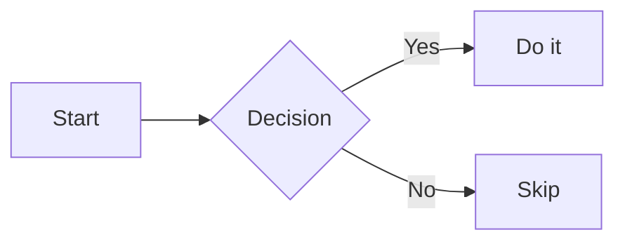

# Markdown Reference

A self-demonstrating reference for the standard Markdown syntax rendered by the built-in preview. Each feature shows its **source** in a code block immediately followed by the **live rendered result**. Open this file in a preview pane to see it all render. The only exception is the final section, which by definition lists syntax the built-in preview does **not** render.

> The YAML block at the very top of this file is front matter. In current preview versions it renders as a table above this heading. See the Front Matter section below.

---

## Headings

Use one to six `#` characters (ATX style).

```markdown
# Heading 1
## Heading 2
### Heading 3
#### Heading 4
##### Heading 5
###### Heading 6
```

Rendered:

# Heading 1
## Heading 2
### Heading 3
#### Heading 4
##### Heading 5
###### Heading 6

Setext style covers levels 1 and 2 by underlining text with `=` or `-`.

```markdown
Setext Level 1
==============

Setext Level 2
--------------
```

Rendered:

Setext Level 1
==============

Setext Level 2
--------------

---

## Paragraphs and Line Breaks

Blank lines separate paragraphs. End a line with two trailing spaces or a backslash `\` to force a line break inside a paragraph.

```markdown
First paragraph.

Second paragraph with a hard break here\
and this continues on a new line.
```

Rendered:

First paragraph.

Second paragraph with a hard break here\
and this continues on a new line.

---

## Text Formatting

| Element | Syntax | Result |
| --- | --- | --- |
| Bold | `**text**` or `__text__` | **text** |
| Italic | `*text*` or `_text_` | *text* |
| Bold + italic | `***text***` | ***text*** |
| Strikethrough | `~~text~~` | ~~text~~ |
| Inline code | `` `code` `` | `code` |

Inline code that itself contains a backtick uses double backticks as the delimiter:

```markdown
Here is `` a `nested` backtick `` inside inline code.
```

Rendered: Here is `` a `nested` backtick `` inside inline code.

---

## Blockquotes

Prefix lines with `>`. Nest by stacking `>`, and place other elements inside.

```markdown
> A quote.
>
> > A nested quote.
>
> - List inside a quote
> - **Formatting** works too
```

Rendered:

> A quote.
>
> > A nested quote.
>
> - List inside a quote
> - **Formatting** works too

---

## Lists

### Unordered

Use `-`, `*`, or `+`.

```markdown
- Item one
- Item two
- Item three
```

Rendered:

- Item one
- Item two
- Item three

### Ordered

Numbers followed by a period. The actual numbers need not be sequential.

```markdown
1. First
2. Second
3. Third
```

Rendered:

1. First
2. Second
3. Third

### Nested and mixed

Indent two to four spaces to nest. Items can hold paragraphs and other blocks.

```markdown
1. Parent item
   - Child bullet
   - Another child
     1. Deeper number
2. Second parent

   A paragraph belonging to item 2.
```

Rendered:

1. Parent item
   - Child bullet
   - Another child
     1. Deeper number
2. Second parent

   A paragraph belonging to item 2.

---

## Task Lists

Checkbox lists using `[ ]` (unchecked) and `[x]` (checked). They render as checkboxes (display only in the preview).

```markdown
- [x] Completed task
- [ ] Pending task
- [ ] Another to do
```

Rendered:

- [x] Completed task
- [ ] Pending task
- [ ] Another to do

---

## Code

Inline code uses single backticks: `let x = 1`.

Fenced blocks use triple backticks with an optional language for syntax highlighting:

````markdown
```python
def greet(name: str) -> str:
    return f"Hello, {name}"
```
````

Rendered:

```python
def greet(name: str) -> str:
    return f"Hello, {name}"
```

Tildes are an alternative fence delimiter, useful when the block itself contains backticks:

```markdown
~~~js
const sum = (a, b) => a + b;
~~~
```

Rendered:

~~~js
const sum = (a, b) => a + b;
~~~

Indented code blocks (four leading spaces) also work, though fenced blocks are preferred:

```markdown
    plain indented code, no highlighting
```

Rendered:

    plain indented code, no highlighting

---

## Links

```markdown
[Inline link](https://example.com)
[Link with title](https://example.com "Hover title")
[Reference link][ref]
[Shortcut reference]
https://example.com           (bare URL autolink)
<https://example.com>         (angle autolink)
<you@example.com>             (email autolink)
[Jump to Tables](#tables)     (link to a heading on this page)

[ref]: https://example.com
[Shortcut reference]: https://example.com
```

Rendered: [Inline link](https://example.com), [Link with title](https://example.com "Hover title"), [Reference link][ref], [Shortcut reference], bare URL https://example.com, angle <https://example.com>, email <you@example.com>, and [Jump to Tables](#tables).

[ref]: https://example.com
[Shortcut reference]: https://example.com

Heading anchors are the heading text, lowercased, with spaces replaced by hyphens.

---

## Images

Same as links with a leading `!`. Alt text goes in the brackets; an optional title goes in quotes. The example below uses a self-contained data URI so it renders with no network access.

```markdown

![Reference image][logo]

[logo]: path/to/image.png
```

Rendered:


![Reference image][logo]

[logo]: data:image/png;base64,iVBORw0KGgoAAAANSUhEUgAAAHgAAAAoCAIAAAC6iKlyAAAAY0lEQVR42u3bQQkAIBQFwRfDaOYxkO28W+GD4kEGNsHcN2tMPSgIQH8KndZ1PdCgQQs0aNCgQYMWaNCgQYMGLdCgQYMGDVqgQYMGDRq0QIMGDRo0aIEGDRo0aNA6hZaHBbTKbQW5Xh9oSY70AAAAAElFTkSuQmCC

---

## Tables

Pipes separate columns; the divider row sets alignment with colons: `:---` (left), `:---:` (center), `---:` (right).

```markdown
| Left | Center | Right |
| :--- | :----: | ----: |
| a    | b      | c     |
| long | text   | 123   |
```

Rendered:

| Left | Center | Right |
| :--- | :----: | ----: |
| a    | b      | c     |
| long | text   | 123   |

Leading and trailing pipes are optional:

```markdown
Left | Center | Right
:--- | :----: | ----:
a | b | c
```

Rendered:

Left | Center | Right
:--- | :----: | ----:
a | b | c

---

## Horizontal Rule

Three or more `-`, `*`, or `_` on their own line.

```markdown
---
```

Rendered:

---

## Math

Inline math is wrapped in single dollar signs; block math in double dollar signs. Rendered by the built-in math renderer.

```markdown
Inline: $E = mc^2$

$$
\int_0^\infty e^{-x}\,dx = 1
$$
```

Rendered:

Inline: $E = mc^2$

$$
\int_0^\infty e^{-x}\,dx = 1
$$

---

## Mermaid Diagrams

A fenced block tagged `mermaid` renders as a diagram (built into the preview in current versions).

````markdown

````

Rendered:


---

## Inline and Block HTML, and Entities

Raw HTML passes through. Inline tags cover gaps in core Markdown such as subscript, superscript, highlight, and underline. Block-level HTML works too, and named or numeric HTML entities render.

```markdown
H<sub>2</sub>O and x<sup>2</sup>, <mark>highlight</mark>, <u>underline</u>.

<div>
  A raw block-level HTML element.
</div>

Copyright &copy; 2026 &trade;, arrows &rarr; and &larr;, ellipsis &hellip;
```

Rendered:

H<sub>2</sub>O and x<sup>2</sup>, <mark>highlight</mark>, <u>underline</u>.

<div>
  A raw block-level HTML element.
</div>

Copyright &copy; 2026 &trade;, arrows &rarr; and &larr;, ellipsis &hellip;

---

## Escaping Characters

Precede a Markdown control character with a backslash `\` to show it literally.

```markdown
\*not italic\*, \# not a heading, \`not code\`, 1\. not a list
```

Rendered:

\*not italic\*, \# not a heading, \`not code\`, 1\. not a list

---

## Front Matter

A YAML block fenced by `---` at the very top of a file is front matter (metadata). In current preview versions it renders as a table at the top of the document; scroll up to the top of this rendered file to see it.

```markdown
---
title: My Document
author: Adam
date: 2026-06-26
tags: [markdown, reference]
---
```

---

## Not Rendered by the Built-In Preview

These appear in some Markdown flavors but need an extension (for example, Markdown Preview Enhanced) to render. They are shown as source only because the built-in preview leaves them as literal text:

- Footnotes: `Text[^1]` paired with `[^1]: definition`
- Emoji shortcodes: `:smile:` (a pasted Unicode emoji still works, since it is just text)
- Definition lists, abbreviations, and other Markdown Extra constructs
- Custom fenced containers: `::: warning ... :::`
- Custom CSS theming and PDF or image export

> Built-in support for math, Mermaid diagrams, and HTML file preview reflects current versions; Mermaid and HTML preview were added in VS Code 1.121 (May 2026). Older versions may need an extension for Mermaid.
