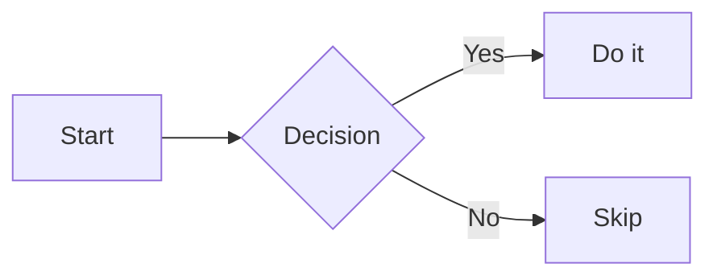
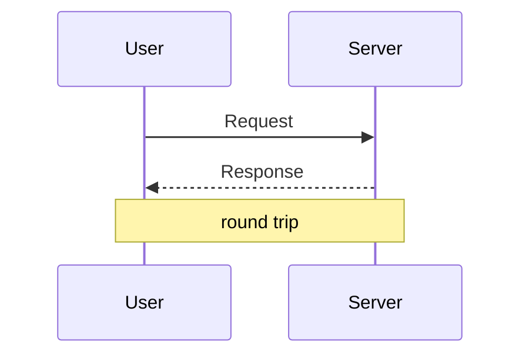
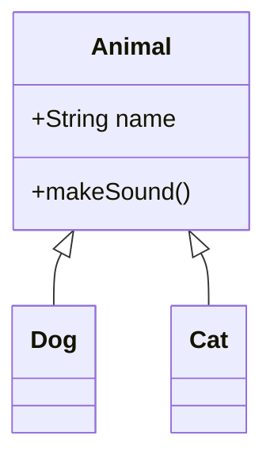
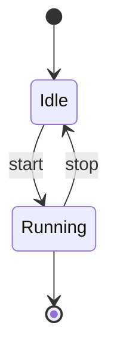
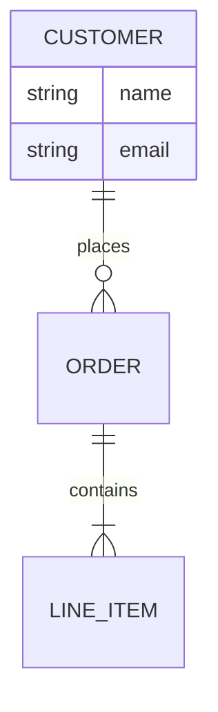
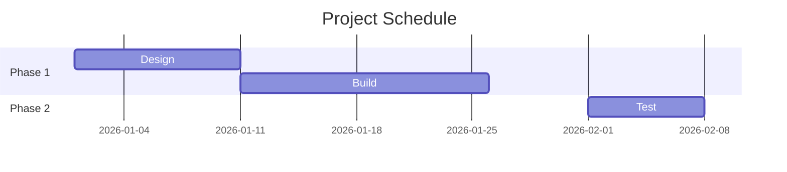
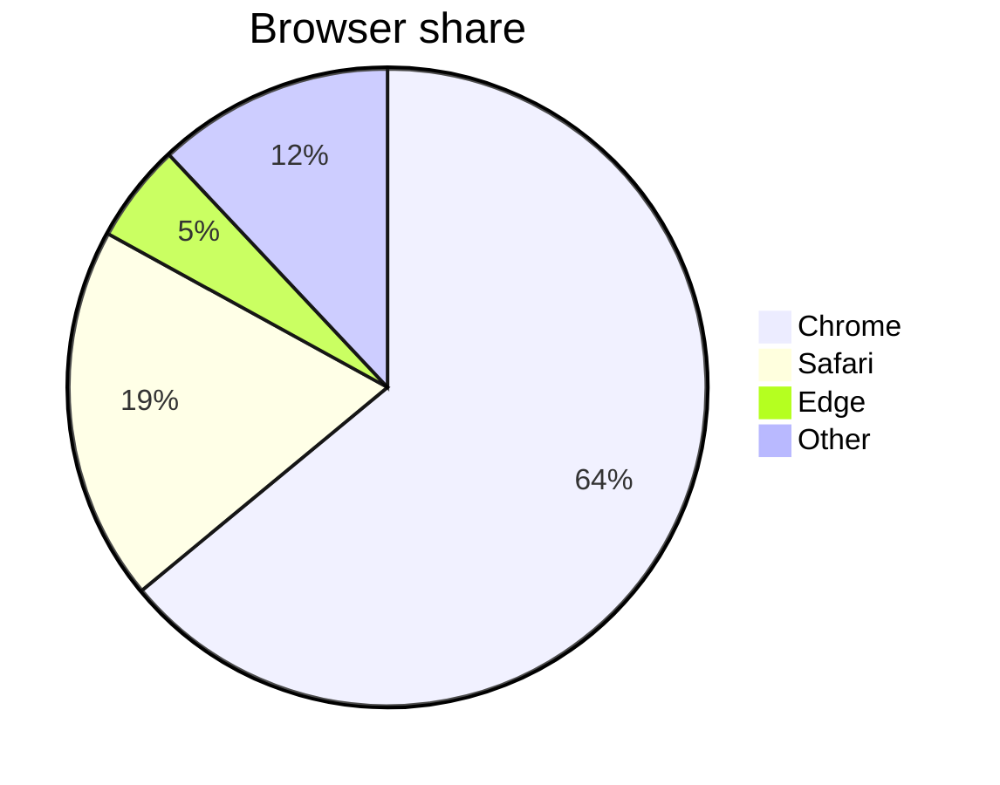
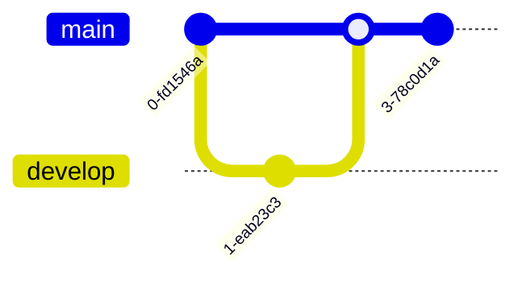
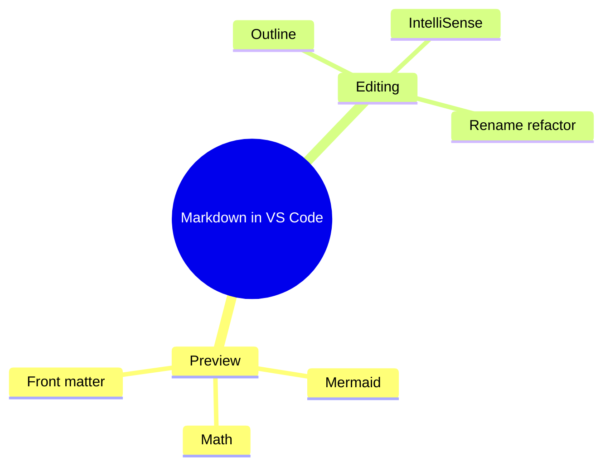
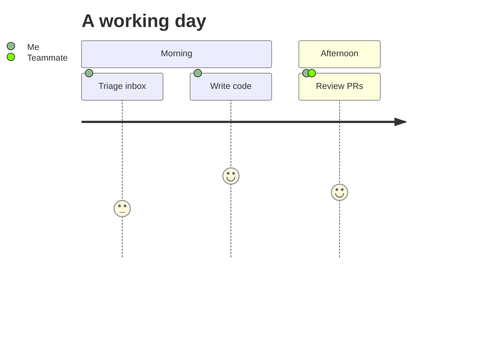

# What You Can Do With Markdown in VS Code

A survey of native Markdown functionality in Visual Studio Code, no extensions required. Scope reflects current stable VS Code (1.121, May 2026 and later). "Native" means it works in a clean install with the built-in Markdown support. A final section lists what still needs an extension.

Two quick framing facts. The preview is powered by the `markdown-it` library and officially targets the CommonMark spec, so it is not full GitHub Flavored Markdown out of the box. In practice the core preview does render a few GFM-style extras (tables, strikethrough, fenced-code syntax highlighting), but several popular GFM features (task list checkboxes, footnotes, alerts, emoji shortcodes) are not in the core and need an extension.

---

## 1. What the preview renders natively

These render in the built-in preview (Ctrl+Shift+V) with no extension:

| Feature | Syntax | Notes |
| --- | --- | --- |
| Headings | `#` to `######`, or Setext `===` / `---` | Feed the Outline view and Go to Symbol |
| Bold / italic / bold-italic | `**`, `*`, `***` | |
| Strikethrough | `~~text~~` | markdown-it default |
| Blockquotes (nested) | `>` , `> >` | |
| Ordered / unordered / nested lists | `-` `*` `+`, `1.` | |
| Tables with alignment | `| a | b |` plus `:---:` row | markdown-it default |
| Inline code and fenced code | `` `x` ``, triple backtick or `~~~` | Fenced blocks get syntax highlighting by language |
| Indented code blocks | four leading spaces | |
| Links, reference links, anchors | `[t](url)`, `[t][ref]`, `[t](#heading)` | |
| Angle-bracket autolinks | `<https://example.com>` | CommonMark core |
| Images | `` | |
| Horizontal rules | `---`, `***`, `___` | |
| Inline and block HTML | `<sub>`, `<mark>`, `<div>` | Subject to preview security settings |
| HTML entities | `&copy;`, `&rarr;` | |
| Escaping | `\*`, `\#` | |
| Math (KaTeX) | `$x^2$`, `$$ ... $$` | KaTeX is a large subset of LaTeX math, not all of it |
| Mermaid diagrams | ```` ```mermaid ```` fenced block | Built in since 1.121; see Section 2 |
| YAML front matter | `---` block at top of file | Rendered as a table at the top since 1.121 |

---

## 2. Mermaid diagrams

This is the part most people underestimate. Mermaid is not just flowcharts. The bundled renderer (merged from Matt Bierner's extension into the core as "Mermaid Markdown Features") supports the full Mermaid diagram catalog, and in the preview you can pan and zoom large diagrams, use on-diagram controls, and right-click to Copy Diagram Source.

Below are live examples of the established diagram types. Because this file is itself Markdown, the raw source doubles as the syntax reference for each one.

Flowchart:



Sequence diagram:



Class diagram:



State diagram:



Entity relationship diagram:



Gantt chart:



Pie chart:



Git graph:



Mindmap:



User journey:



### Full diagram catalog

Every Mermaid diagram type and its opening keyword. The established ones render in any recent bundled Mermaid; the newest few render only if the bundled Mermaid version is recent enough, so verify in your build.

| Diagram | Keyword | Status |
| --- | --- | --- |
| Flowchart | `flowchart` / `graph` | Established |
| Sequence | `sequenceDiagram` | Established |
| Class | `classDiagram` | Established |
| State | `stateDiagram-v2` | Established |
| Entity relationship | `erDiagram` | Established |
| User journey | `journey` | Established |
| Gantt | `gantt` | Established |
| Pie | `pie` | Established |
| Git graph | `gitGraph` | Established |
| Mindmap | `mindmap` | Established |
| Timeline | `timeline` | Established |
| Quadrant chart | `quadrantChart` | Established |
| Requirement | `requirementDiagram` | Established |
| C4 | `C4Context` (and variants) | Established |
| ZenUML | `zenuml` | Established |
| Sankey | `sankey-beta` | Beta |
| XY chart | `xychart-beta` | Beta |
| Block | `block-beta` | Beta |
| Packet | `packet-beta` | Beta |
| Kanban | `kanban` | Recent |
| Architecture | `architecture-beta` | Recent, version dependent |
| Radar | `radar` | New, version dependent |
| Treemap | `treemap` | New, version dependent |
| Ishikawa (fishbone) | `ishikawa` | New, version dependent |

---

## 3. Math with KaTeX

Inline math uses single dollar signs and block math uses double. Rendered by KaTeX, which covers a large subset of LaTeX math (most symbols, fractions, sums, integrals, matrices, aligned environments) but not arbitrary LaTeX packages.

```markdown
Inline: $a^2 + b^2 = c^2$

$$
\left( \sum_{k=1}^n a_k b_k \right)^2 \leq \left( \sum_{k=1}^n a_k^2 \right)\left( \sum_{k=1}^n b_k^2 \right)
$$
```

Rendered:

Inline: $a^2 + b^2 = c^2$

$$
\left( \sum_{k=1}^n a_k b_k \right)^2 \leq \left( \sum_{k=1}^n a_k^2 \right)\left( \sum_{k=1}^n b_k^2 \right)
$$

Toggle with `markdown.math.enabled`.

---

## 4. Native authoring and editor features

These are editor-side features (not preview rendering). They work with no extension. Shortcuts shown are Windows and Linux.

| Feature | How to use | What it does |
| --- | --- | --- |
| Document outline | Outline view in Explorer | Shows the header hierarchy of the file |
| Go to header in file | Ctrl+Shift+O | Jump to any heading in the current file |
| Go to header in workspace | Ctrl+T | Search headings across all Markdown files |
| Path IntelliSense | type a link or image path | Completes file paths; `/` for workspace root, `./` relative, `#` for headings in this file, `##` for headings anywhere in the workspace |
| Insert by drag and drop | drag from Explorer or OS, hold Shift | Drops a Markdown link or image at the cursor |
| Insert by paste | paste a file, image, or URL | Choose a Markdown link or plain text; pasted images are auto-copied into the workspace per `markdown.copyFiles.destination` |
| Insert from workspace | command palette | "Insert Image from Workspace" and "Insert Link to File in Workspace" |
| Smart selection | Shift+Alt+Right / Left | Expand or shrink selection by syntax (block, then section, then header) |
| Link validation | set `markdown.validate.enabled: true` | Flags broken links to files, headings, and reference definitions; all local, no external HTTP checks |
| Find all references | Shift+Alt+F12 | Every place a heading or link is referenced in the workspace |
| Rename symbol | F2 on a heading or link | Renames and updates every link to it; on a file link, renames the file and updates links |
| Auto link update on move | set `markdown.updateLinksOnFileMove.enabled` | Rewrites links when a linked file, image, or folder is moved or renamed |
| Snippets | Ctrl+Space | Built-in snippets for code blocks, images, and more |
| Generate alt text | lightbulb on an image | AI-assisted alt text (requires GitHub Copilot) |

---

## 5. Native preview features

| Feature | How | Notes |
| --- | --- | --- |
| Open preview | Ctrl+Shift+V | Full-tab preview |
| Open preview to the side | Ctrl+K V | Live side-by-side while editing |
| Scroll sync | automatic | Editor and preview track each other; a gray margin bar marks the current editor line |
| Jump to source | double-click in preview | Opens the editor at the nearest line |
| Preview locking | "Markdown: Toggle Preview Locking" | Pins a preview to one file instead of following the active editor |
| Diff preview | "View: Reopen Editor With... > Markdown Preview" | Renders a source-control diff as a rendered document with changes highlighted; inline or side-by-side |
| Preview security | "Markdown: Change preview security settings" | Strict (default), Allow insecure content, or Disable; controls scripts and HTTP content |
| Custom preview CSS | `markdown.styles` | Load your own stylesheets into the preview |
| Extend the parser | `markdown.markdownItPlugins` | The hook every preview extension (footnotes, alerts, checkboxes) uses, so they all work in this same preview |

---

## 6. Key settings

| Setting | Purpose |
| --- | --- |
| `markdown.math.enabled` | KaTeX math rendering (on by default) |
| `markdown.validate.enabled` | Local link validation (off by default) |
| `markdown.updateLinksOnFileMove.enabled` | Auto-fix links on move or rename (`never` / `prompt` / `always`) |
| `markdown.copyFiles.destination` | Where pasted or dropped images are stored |
| `markdown.suggest.paths.enabled` | Path IntelliSense in links and images |
| `markdown.preview.scrollPreviewWithEditor` | Editor-to-preview scroll sync |
| `markdown.styles` | Custom CSS for the preview |
| `"[markdown]": { "files.trimTrailingWhitespace": false }` | Preserve two-space hard line breaks |

---

## 7. Markdown beyond .md files

The same engine renders Markdown in other VS Code surfaces, natively:

- Markdown cells in Jupyter notebooks, including the math and Mermaid rendering above.
- Hover tooltips and many panels that display Markdown.
- HTML file preview in the Integrated Browser, added alongside Mermaid in 1.121 (this previews `.html`, separate from Markdown, but shipped in the same release).

---

## 8. What still needs an extension

Not native to the core preview. Each needs an extension to render or work:

| Want | Needs |
| --- | --- |
| Task list checkboxes (`- [ ]`) | Markdown Checkboxes (bundled in `bierner.github-markdown-preview`); display only, never clickable |
| Interactive (clickable) checkboxes | A dedicated checkbox extension that toggles the source |
| Footnotes (`[^1]`) | `bierner.markdown-footnotes` |
| GitHub alerts (`> [!NOTE]`) | `yahyabatulu.vscode-markdown-alert` or similar |
| Emoji shortcodes (`:smile:`) | Markdown Emoji (Unicode emoji pasted directly already work as text) |
| Definition lists, abbreviations, custom `:::` containers | Markdown Preview Enhanced or specific plugins |
| GitHub-styled preview theme | `bierner.markdown-preview-github-styles` |
| Linting and style rules | `DavidAnson.vscode-markdownlint` |
| Table of contents, bold/italic shortcuts, table formatter | `yzhang.markdown-all-in-one` |
| Export to PDF, HTML, or PNG | Markdown Preview Enhanced or a PDF extension |
| Spell checking | `streetsidesoftware.code-spell-checker` |

> Tip: `bierner.github-markdown-preview` is an extension pack that bundles footnotes, checkboxes, emoji, and GitHub styling in one install, all of which plug into the same native preview.
